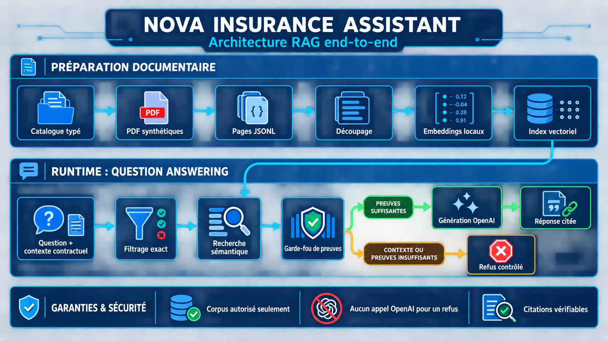
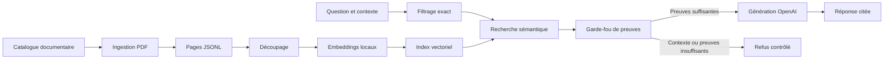

# Nova Insurance Assistant

[](https://github.com/BambaSpoid/nova-insurance-assistant/actions/workflows/ci.yml)

Assistant documentaire RAG pour explorer un corpus entièrement synthétique de
contrats d’assurance habitation, automobile et voyage.

Nova sélectionne d’abord les documents applicables au contexte contractuel,
effectue ensuite une recherche sémantique limitée à ce corpus, puis autorise ou
refuse la génération selon des signaux de preuve externes au modèle.

> Ce projet est une démonstration technique. Les contrats, garanties, montants
> et situations sont fictifs. Les réponses ne constituent ni un conseil
> juridique, ni un conseil financier, ni une décision d’assurance.

## Fonctionnalités

- sélection exacte du corpus par produit, version ou date de contrat ;
- ingestion déterministe de documents PDF ;
- découpage avec chevauchement et métadonnées traçables ;
- embeddings multilingues exécutés localement ;
- index vectoriel NumPy persistant ;
- recherche sémantique limitée aux documents autorisés ;
- garde-fou déterministe avant toute génération ;
- refus contrôlés en cas de contexte manquant, de corpus absent, de preuves
  insuffisantes ou de sources contradictoires ;
- génération OpenAI avec citations structurées ;
- interface conversationnelle Streamlit ;
- jeu d’évaluation reproductible de 30 cas métier ;
- rapports d’évaluation hors ligne et complets.

## Architecture





Le modèle génératif ne choisit jamais lui-même le corpus et ne décide pas si
les preuves sont suffisantes. Ces décisions sont prises avant son appel.

## Résultats actuels

- 11 documents synthétiques ;
- 31 pages PDF ingérées ;
- 92 passages indexés ;
- 30 cas d’évaluation, répartis équitablement entre les trois produits ;
- 100 % de réussite sur l’évaluation hors ligne ;
- 100 % de réussite sur l’évaluation complète enregistrée ;
- 117 tests automatisés.

Les rapports de référence sont disponibles dans
[`data/evaluation/results`](data/evaluation/results).

## Technologies

- Python 3.12 ;
- Poetry ;
- Pydantic ;
- pypdf ;
- Sentence Transformers ;
- `intfloat/multilingual-e5-small` ;
- NumPy ;
- OpenAI Responses API ;
- Streamlit ;
- pytest ;
- Ruff.

## Prérequis

- Python 3.12 ;
- Poetry 2.x ;
- Git ;
- une connexion Internet lors du premier téléchargement du modèle
  Sentence Transformers ;
- une clé OpenAI uniquement pour les réponses générées et l’évaluation
  complète.

## Installation

Clonez le dépôt, puis installez les dépendances :

```bash
git clone https://github.com/BambaSpoid/nova-insurance-assistant.git
cd nova-insurance-assistant

pyenv local 3.12.1
poetry install
```

Si `pyenv` n’est pas utilisé, vérifiez simplement que Poetry emploie une
version Python compatible :

```bash
poetry run python --version
```

## Préparer les données

Les PDF et le fichier de pages ingérées sont suivis par Git. L’index vectoriel,
en revanche, est généré localement et ignoré par Git.

Pour reconstruire toute la chaîne :

```bash
poetry run python scripts/generate_corpus_pdfs.py
poetry run python scripts/ingest_corpus.py
poetry run python scripts/build_index.py
```

Pour un clone standard, la reconstruction de l’index suffit généralement :

```bash
poetry run python scripts/build_index.py
```

Les artefacts produits sont :

```text
data/processed/pages.jsonl
data/index/chunks.jsonl
data/index/embeddings.npy
data/index/manifest.json
```

## Lancer l’application

Sans clé OpenAI, les clarifications et refus déterministes restent
fonctionnels :

```bash
poetry run streamlit run app.py \
  --server.address localhost \
  --server.port 8501
```

L’application est alors accessible sur
[http://localhost:8501](http://localhost:8501).

### Activer la génération OpenAI

La clé peut être fournie temporairement par l’environnement :

```bash
read -r -s "OPENAI_API_KEY?Clé OpenAI API : "
echo
export OPENAI_API_KEY

poetry run streamlit run app.py \
  --server.address localhost \
  --server.port 8501
```

Retirez-la de la session après utilisation :

```bash
unset OPENAI_API_KEY
```

Elle peut aussi être placée dans un fichier local non suivi :

```bash
cp .streamlit/secrets.toml.example \
  .streamlit/secrets.toml
```

Puis remplacez la valeur d’exemple dans `.streamlit/secrets.toml`. Ce fichier
est ignoré par Git.

Ne placez jamais une vraie clé dans le code, le README, un commit ou une
capture d’écran.

## Déployer sur Streamlit Community Cloud

L’application peut être déployée directement depuis GitHub. L’index vectoriel
n’est pas suivi par Git : il est automatiquement construit lors du premier
démarrage, puis conservé dans le cache de l’application.

1. Ouvrez [Streamlit Community Cloud](https://share.streamlit.io/) et
   connectez votre compte GitHub.
2. Créez une application à partir du dépôt
   `BambaSpoid/nova-insurance-assistant`.
3. Sélectionnez la branche `main` et le fichier principal `app.py`.
4. Dans les paramètres avancés, choisissez Python 3.12.
5. Ajoutez la clé dans les secrets Streamlit :

```toml
OPENAI_API_KEY = "votre-cle-openai"
```

La clé ne doit jamais être ajoutée au dépôt, au README ou à un fichier suivi
par Git. Le fichier local `.streamlit/secrets.toml` est volontairement ignoré.

Le premier démarrage peut prendre quelques minutes, car le modèle
Sentence Transformers est téléchargé et l’index des documents est construit.
Les redémarrages suivants réutilisent les ressources mises en cache.

Pour partager la démonstration avec des personnes qui n’ont pas accès au dépôt
privé, configurez séparément la visibilité publique de l’application depuis
les paramètres Streamlit.

## Évaluation

### Mode hors ligne

Ce mode teste la sélection, le périmètre de recherche, la présence des preuves
et les décisions du garde-fou sans appeler OpenAI :

```bash
poetry run python scripts/run_evaluation.py \
  --mode offline
```

### Mode complet

Ce mode génère les réponses autorisées et contrôle également les citations et
les termes interdits :

```bash
poetry run python scripts/run_evaluation.py \
  --mode full \
  --model gpt-5.4-mini \
  --top-k 5 \
  --max-sources 5 \
  --max-output-tokens 180
```

Le mode complet nécessite `OPENAI_API_KEY` et peut entraîner des coûts API.

Les rapports sont enregistrés dans `data/evaluation/results/`.

## Qualité et tests

Formater le code :

```bash
poetry run ruff format .
```

Vérifier le code :

```bash
poetry run ruff check .
```

Exécuter les tests :

```bash
poetry run pytest
```

Validation complète recommandée avant un commit :

```bash
poetry run ruff check .
poetry run pytest
git diff --check
```

Les tests unitaires n’appellent pas l’API OpenAI. Les appels réels sont
réservés à l’évaluation complète et aux tests manuels explicitement lancés.

## Structure du dépôt

```text
.
├── app.py
├── data/
│   ├── catalog/          # Catalogue documentaire typé
│   ├── corpus/           # Sources Markdown et PDF synthétiques
│   ├── evaluation/       # Jeu et rapports d’évaluation
│   ├── index/            # Index local généré, ignoré par Git
│   └── processed/        # Pages extraites
├── docs/
│   └── business_rules.md
├── scripts/
│   ├── build_index.py
│   ├── generate_corpus_pdfs.py
│   ├── ingest_corpus.py
│   └── run_evaluation.py
├── src/nova_assistant/
│   ├── decision/         # Garde-fou et service de réponse
│   ├── domain/           # Catalogue et modèles métier
│   ├── evaluation/       # Exécution et rapports d’évaluation
│   ├── filtering/        # Sélection exacte du corpus
│   ├── generation/       # Prompts et génération citée
│   ├── indexing/         # Découpage, embeddings et index
│   ├── ingestion/        # Extraction déterministe des PDF
│   ├── retrieval/        # Recherche sémantique filtrée
│   └── ui/               # Service et présentation Streamlit
└── tests/
```

## Principes de sûreté

1. Le corpus applicable est déterminé par des filtres métier exacts.
2. La recherche vectorielle ne peut pas sortir de ce corpus.
3. La génération est bloquée lorsque les preuves sont insuffisantes.
4. Les réponses générées doivent contenir des citations valides.
5. Les citations affichées correspondent exactement aux sources utilisées.
6. Les instructions présentes dans les documents sont traitées comme du
   contenu, jamais comme des commandes.
7. Les réponses et rapports API sont créés avec `store=False`.
8. Les secrets locaux ne sont jamais suivis par Git.

## Limites

- corpus volontairement réduit et synthétique ;
- recherche dense sans reranker spécialisé ;
- heuristiques de contradiction adaptées au domaine de démonstration ;
- absence d’authentification utilisateur ;
- historique limité à la session Streamlit ;
- absence actuelle de supervision des coûts et de télémétrie ;
- aucune utilisation destinée à traiter de vrais contrats ou sinistres.

## Documentation métier

Les hypothèses et règles fonctionnelles détaillées sont décrites dans
[`docs/business_rules.md`](docs/business_rules.md).
